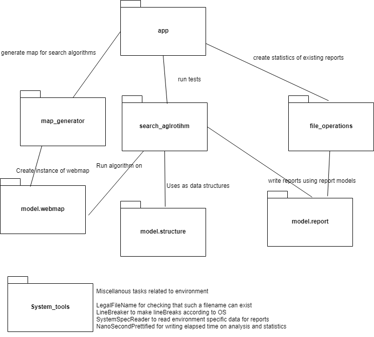

# Project implementation

## Structure

**Here is shown structure of app and file directories it uses with their purpose**
Due to large amount of classes it's simplified down to package level. package name should already tell its reponsibility.

## Project Documentation 
All public and protected methods and classes. Some regular getters and setter may be skipped.
[Javadoc](https://github.com/kapistelijaKrisu/searching-comparison-with-map-gen/blob/master/doc/javadoc/index.html)

## Testing 
[test doc](https://github.com/kapistelijaKrisu/searching-comparison-with-map-gen/blob/master/doc/TestDoc.md)  
[test coverage](https://github.com/kapistelijaKrisu/searching-comparison-with-map-gen/blob/master/doc/coverage/html/index.html)

## Analysis

#### Report test run of algorithm
Algorithms can't be compared on different map for example 2x2 vs 200x200 map. So they are separated in folders by map name. doc/reports/map name folder/  
Creates user friendly md file showing how a single algorithm test run went. Shows algorithm basic info and implementaiton info time, space, path, path weight, how much of the map was explored. 

#### Overview of algorithm tests
As we gain samples we can create statistics of this. Created statistics will be at doc/reports/map name folder/ level. Statistics divide the results by algorithm name and implementation type additionally to the map division at start. 
  
Statistics are made by taking an average of time, space, path weight, portion of map explored (in case someone wants to make an algorithm that chooses next step randomly). Then it picks fastest and most space efficient algorithm to show on top and list all unique implementations (plus and minus, by naming another algorithm and implementation same it will be flattened. Useful with names though, not used sadly yet)
